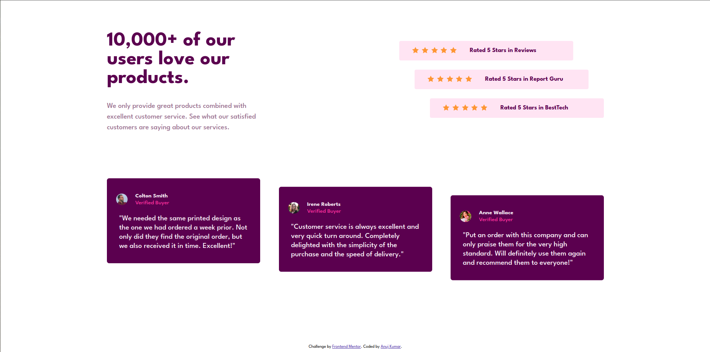
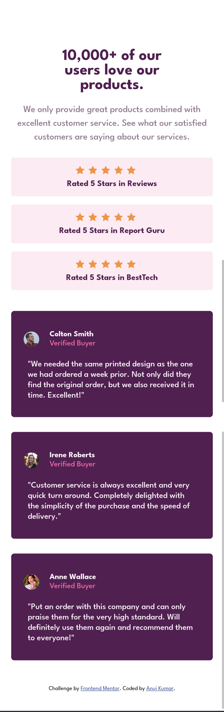

# Frontend Mentor - Social proof section solution

This is a solution to the [Social proof section challenge on Frontend Mentor](https://www.frontendmentor.io/challenges/social-proof-section-6e0qTv_bA). Frontend Mentor challenges help you improve your coding skills by building realistic projects.

## Table of contents

- [Overview](#overview)
  - [The challenge](#the-challenge)
  - [Screenshot](#screenshot)
  - [Links](#links)
- [My process](#my-process)
  - [Built with](#built-with)
  - [What I learned](#what-i-learned)
  - [Continued development](#continued-development)
  - [Useful resources](#useful-resources)
- [Author](#author)
- [Acknowledgments](#acknowledgments)

## Overview

### The challenge

Users should be able to:

- View the optimal layout depending on their device's screen size

### Screenshot

### Links

- Solution URL: [Solution](https://github.com/akarj/frontend-mentor-challenges/tree/master/newbie-challenges/social-proof-section)
- Live Site URL: [Card Preview on Live Site](https://front-end-mentor-challenges-akarj.netlify.app/newbie-challenges/social-proof-section/)

### Built with

- Semantic HTML5 markup
- CSS custom properties
- Grid layout
- Flexbox
- Mobile-first workflow

### What I learned

I learned how to structure the layout, use of Grid and Flex to develop the UI of the page.

## Author

- Frontend Mentor - [@akarj](https://www.frontendmentor.io/profile/akarj)
- Twitter - [@akarj\_](https://www.twitter.com/akarj_)
- LinkedIn - [@akarj](https://www.linkedin.com/in/akarj)

## Acknowledgments

- [CSS Tricks](https://css-tricks.com/snippets/css/complete-guide-grid/)
- [Kevin Powell](https://www.kevinpowell.co/)
- [Wes Bos](https://wesbos.com/)
